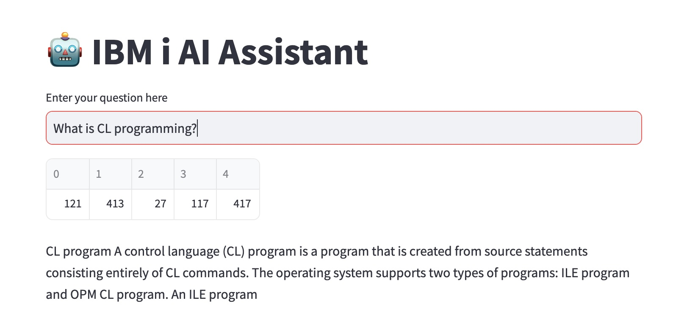

# Watsonx Challenge Protoype 
Jupyter notebook with streamlit GUI 
Before starting, please check `lab-0-laptop-environment-setup` and follow the instructions to install the prereqs on your laptop  
# Startup 🚀
1. Open your terminal or console window
2. cd into this lab's base directory
3. Copy your .env file into this lab's base folder
4. Run the app by running the command `streamlit run app.py`



## Instructions for Installing the Streamlit App

1. Create a new virtual environment:

   ```
   python3.11 -m venv env
   source env/bin/activate
   ```

2. Install the required packages:

   ```
   pip install -r requirements.txt
   ```

3. Set up your environment variables and API keys:

   - Create a `.env` file 
   - Go to IBM Cloud (IAM API Key) or for IBMers , https://bam.res.ibm.com/ and login to retrieve your API keys
   - Add your API keys and other required environment variables to the `.env` file.

   ```
    GENAI_KEY=<Your API Key>
    GENAI_API=https://bam-api.res.ibm.com
   ```
   
*Note: Sometimes you need to restart your terminal and reactivate your environment before starting the streamlit app for the first time or you will get a module not found error*

4. Run the Streamlit application:

   ```
   streamlit run app.py
   ```


