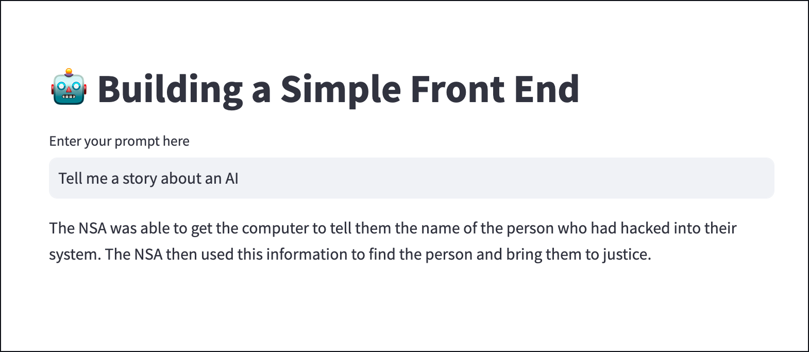

# Watsonx Challenge Protoype 
Jupyter notebook with streamlit GUI 
Before starting, please check `lab-0-laptop-environment-setup` and follow the instructions to install the prereqs on your laptop  
# Startup 🚀
1. Open your terminal or console window
2. cd into this lab's base directory
3. Copy your .env file into this lab's base folder
4. Run the app by running the command `streamlit run app.py`

